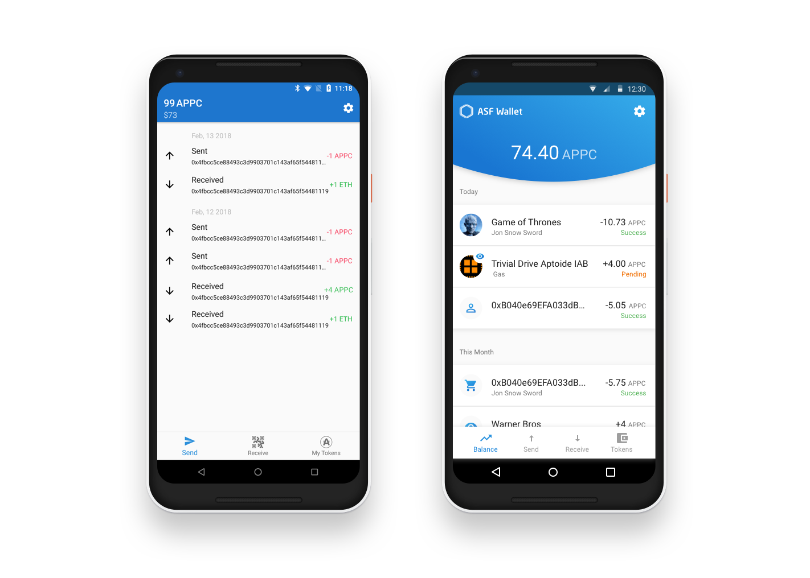
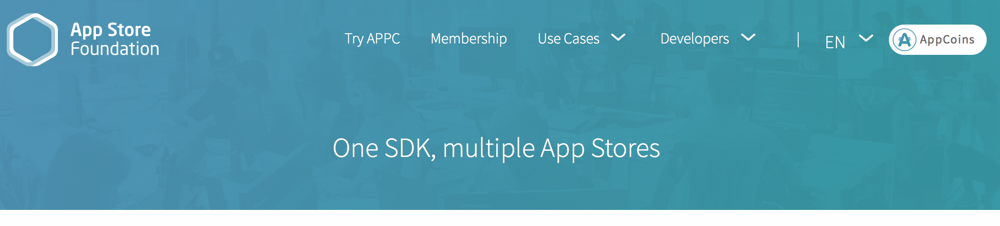
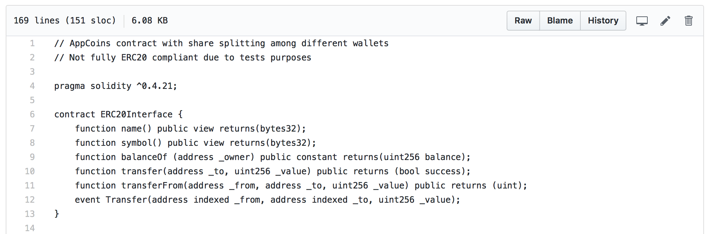

# AppCoins Protocol Definition

## What is the AppCoins Protocol ? 

The AppCoins Protocol is an open, neutral and distributed platform for App Store flows (In-App Purchases, User Acquisition, App Vetting) built on the Ethereum blockchain. 

It aims to mitigate the current inherent deficiencies of app stores. By marrying blockchain with app store technology, user acquisiton, in-app billing and app approval can be drastically improved and sped up through disintermediation and redistributing the unlocked value to end-users and developers. 

“AppCoin” ERC20 token will be used by the developers to generate Revenues from In-App Purchases and to advertise their Apps to the users. From every advertising investment inside the app store, 85% goes to the user. The user can use those coins to buy items (in-app purchases) or to buy coins in the market, generating the return of the investment to the developers. In parallel, the User Acquisition and IAB transactions are used to establish the reputation of the developer.

The design of the AppCoins Protocol rests on three main pillars: 

<ul class="simplelist">

<li> transparency </li> 

<li> equitability</li>

<li> community-focused</li>
</ul>

Firstly, open and transparent standards facilitate trust and privacy. Secondly, revenue shares are redistributed away from unnecessary intermediaries to end-users and developers. Thirdly, through open-source code, knowledge is accessible to the community.

## What problem is the AppCoins Protocol solving?

Today there are 2.1 bn smartphone users in the world generating more than \$77 bn in annual gross revenue. Those numbers are projected to double by 2020. However, app stores are still riddled with inefficiencies and malware. In-app purchases (IAP) are not accessible to the low-end market, in-app advertising is plagued by too many intermediaries, malware is still prevalent and innovation is slowing down. It is estimated that only 5\% of the users buy IAP or paid apps.

The reasons are diverse: payment models are not suited for emerging countries and younger generations; there is no trust between the actors of the ecosystem; and there is a lack of standardisation defining clear interfaces and enabling market free entry for new players.

The AppCoins Protocol redefines three app store core processes:

* **In-App Purchase (IAP)**: When users want to unlock premium features inside the app or game, the purchase mechanism is tied to the respective app store. To enable payment transactions, the developer has to either integrate the SDK from the app store or use its API. </li>

* **User acquisition inside app store**: Developers advertising to users to install their app or game. There are different advertising models depending on the intended action: CPI (Cost per Installation), CPA (Cost per Action), CPM (Cost per Thousand Impressions) and others. There are different technologies and platforms to support it: Ad networks, Exchanges and RTB (Real Time Bidding).

* **App approval**: To offer the app in the store, developers have to go through a stringent approval process in which the submitted app is screened by anti-virus and anti-malware tools, as well as static and dynamic code analysis platforms. Some app stores also rely on manual app testing.

## Who can benefit from the protocol? 

| Stakeholder | Benefits | Extra information |
|-------|------|:------:|
| Developers | *"One APK - multiple app stores - one wallet"*. You only need to integrate one SDK, and you can distribute to any store (with exception of Google Play). When the users pay using an AppCoins wallet, the APPC (AppCoins currency) will be imediately transferred to your wallet and a transaction is registered in the blockchain. | Integration:   - [ASF SDK](https://github.com/AppStoreFoundation/asf-sdk)   - [Unity Plugin](https://github.com/AppStoreFoundation/AppcoinsUnityPlugin) |
| AppCoins integrators| AppCoins integrators are providers of AppCoins-compatible solutions that follow the protocol and help to make easier the integration for Developers and OEMs. | Protocol:   - [IAP](https://github.com/AppStoreFoundation/docs/wiki/In-App-Purchases)    - [User Acquisition](https://github.com/AppStoreFoundation/docs/wiki/User-Acquisition) |
| OEMs | Android manufacturers for the first time can have a revenue share (5%) of all transactions inside the store. To have that, integrate AppCoins in your existing App Store or pre-load a AppCoins enabled app store. | [Attribution](LINK_MISSING)|
| App Stores | It is proven that, besides Google and Apple, no other store alone can provide enough critial mass to convince developers to do SDK integration. Through consolidation, AppCoins provide app stores with APKs ready to be distributed and monetized from day 0.  | [Attribution](LINK_MISSING)|
| Crypto holders | Although APPC is a utility token, crypto investors have found interest in the APPC currency potential derived from fixed supply (no minting) and exponential demand needed for store transactions.  | Check [AppCoins site](https://appcoins.io) for list of top exchanges |

## Components

In order to support the main App Store flows, three main components had been developed: wallet, SDK / Unity Plugin, and Ethereum Smart Contracts.

ASF (App Store Foundation) provides an open source reference implementation. Other implementation of these components exist and can be freely implemented by App Stores, OEMs and AppCoins integrators. The only requirement is that those implementations follow the AppCoins Protocol to guarantee compatibility. 

### Wallet

ASF Wallet is an Ethereum ERC20 wallet supporting the follow features:

* **Send and Receive AppCoins**: the ASF Wallet is a client for your Ethereum wallet through the store and management of private key in your phone, allowing operations like sending APPC and ETH to other wallets, and receiving as well. 

* **In App Purchases**: through an extended version of [EIP681](https://github.com/ethereum/EIPs/blob/master/EIPS/eip-681.md), ASF wallet is able to execute payments triggered by apps and games and processed by the ASF Wallet.

* **Proof-of-Attention**: AppCoins protocol defines that user acquisition attribution depends on a correct processing of proof-of-attention. ASF Wallet generates a proof-of-attention after the user pays 2 minutes of attention (app / game in foreground).

* **Listing transactions**: ASF Wallet lists previous transactions and provides details on each one.

### SDK / Unity Plugin

An Android [developer's SDK](https://github.com/AppStoreFoundation/asf-sdk/wiki) is provided by ASF to enable the integration of AppCoins in games and apps. This SDK and associated snippets makes it easier for the developer to support AppCoins In-App Purchases and User Acquisiton (proof-of-attention). Since Unity game engine is very popular among Android game developers, a [Unity Plugin](https://github.com/AppStoreFoundation/AppcoinsUnityPlugin) is also provided as an alternative method of integration.

 

### Smart Contracts

ASF smart contracts are coded in Solidity and express the business rules executed in the blockchain.

The parts of the App Store flows that require trust are usually coded in Solidity and deployed in Ethereum main net. For example, the revenue share of an in-app purchase between developer, OEM and App Store and coded in Solidity and the APPC tokens imediately transferred to target wallets, with the guarantee that there is no centralized party that can keep the transaction or hide it.

However, only essential actions are coded into the smart contracts because of the current poor performance and scalability of the blockchain. This trade off between decentralized and centralized is further explained in the [Protocol documentation](https://github.com/AppStoreFoundation/docs/wiki). 

